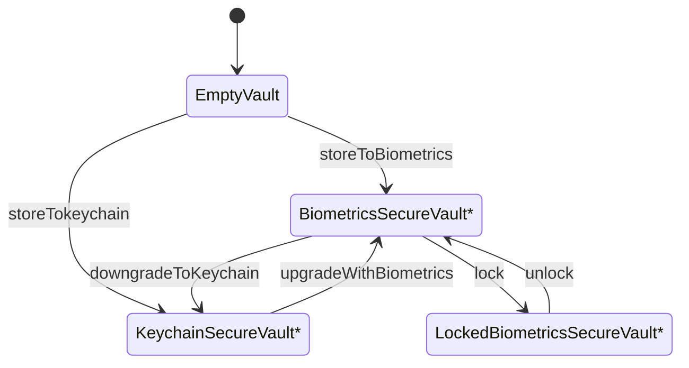

# Biometrics Vault

   

BiometricsVault is a Swift 6.0 package for iOS and macOS that makes supporting biometric login easy.

- [Description](#description)
- [Requirements](#requirements)
- [Installation](#installation)
- [Usage](#usage)
    - [Login without enabling biometrics right away](#without-faceidtouchid)
    - [Upgrade to Biometrics](#upgrade-to-faceidtouchid)
    - [Login and enable Biometrics ](#login-with-credentials-and-remember-with-faceidtouchid)
- [State diagram](#state-diagram)
- [License](#license)

## Description

- BiometricsVault is a library that can store credentials to keychain in two specific ways: Unprotected or protected using biometrics (FaceID/TouchID).
- You can use it to easily implement a login flow that can support biometrics.
- The following scenarios can be easily implemented using BiometricsVault:
  
| Scenario                                    | Required action                                                       | Function          |
| ------------------------------------------- | --------------------------------------------------------------------- | ----------------- |
| New login                                   | Persist the credentials on the keychain across app launches           | storeToKeyChain   |
| New login & immediate biometrics activation | Persist credentials & protect with biometrics                         | storeToBiometrics |
| The user enables FaceID/TouchID             | Protect the credentials using biometrics                              | upgrade           |
| The user disables FaceID/TouchID            | Delete the credentials or store them without biometrics security      | downgrade         |
| Lock the app for security reasons           | Temporarily forget the data that exist in the keychain                | lock              |
| The app is locked & need to unlock          | Ask for FaceID/TouchID authentication and retrieve the credentials    | unlock            |
| The user logs out                           | Delete the credentials from the keychain                              | reset             |

## Requirements

- iOS 14.0+ / macOS 12.0+
- Xcode 16.0+

## Installation

### Swift Package Manager

The [Swift Package Manager](https://swift.org/package-manager/) is a tool for automating the distribution of Swift code and is integrated into the `swift` compiler.

Once you have your Swift package set up, adding BiometricsVault as a dependency is as easy as adding it to the `dependencies` value of your `Package.swift` or the Package list in Xcode.

```swift
dependencies: [
    .package(url: "https://github.com/ariskox/BiometricsVault.git", .upToNextMajor(from: "1.0.0"))
]
```

Add the `BiometricsVault` as a dependency to your target:

```swift
.product(name: "BiometricsVault", package: "BiometricsVault")
```

## Usage

Fist, create a structure that is Codable and Sendable and will hold your credentials

```swift
struct MyCredentials: Codable, Sendable {
    let username: String
    let accessToken: String
}
```

On app startup, use the VaultFactory get a vault. This could be either an empty vault, a vault holding data or a locked vault

``` swift
let key = "my_app_credentials" // This key will be used to identify your credentials in the keychain
let vault = VaultFactory<MyCredentials>.retrieveVault(key: key)

```

 - Switch over the vault type to understand what kind of vault you have and you can decide whether to display a login page, a "biometrics lock" page, or log in the user right away.

```swift
    switch vault {
    case .emptyWithBiometrics(let emptyVault):
        // Go to login screen. Biometrics can be enabled upon login
        displayLoginScreen(biometrics: true)
    case .empty(let vault):
        // Go to login screen. Biometrics cannot be used
        displayLoginScreen(biometrics: false)
    case .keychain(let vault):
        // Log in the user right away and use the credentials from the vault to do so
        displayMainScreen(credentials: vault.credentials)
    case .keychainUpgradable(let vault):
        // Log in the user right away and use the credentials from the vault to do so.
        // The user can enabled the biometrics from the settings screen
        displayMainScreen(credentials: vault.credentials)
    case .biometrics(let vault):
        // Log in the user right away and use the credentials from the vault to do so.
        // The user can disable the biometrics from the settings screen
        displayMainScreen(credentials: vault.credentials)
    case .locked(let vault):
        // Display a 'biometrics locked' screen and prompt the user to unlock using biometrics.
        // Use 'vault.unlock' to unlock the vault
        displayLockScreen(withVault: vault)
        break
    }
```

 - You can also use the helper methods on the 'Vault' that either do the requested operation or throw an error
 
 
 All operations that can be performed on the vaults are listed below.

### Example

For more information check the sample application at the directory [Example](https://github.com/ariskox/BiometricsVault/tree/main/Example)

## Vaults

There are different kinds of vaults

- EmptyVault
    - A vault that doesn't actually stores any information
    - Store credentials (unsecurely) by calling 'storeToKeychain' and get a KeychainSecureVault
    - Store credentials securely by calling 'storeToBiometrics' and get a BiometricsSecureVault
- KeychainSecureVault
    - A vault that holds the credentials on the keychain without any biometrics protection. 
    - Call 'update' to update the credentials
    - Call 'upgrade' to enable biometrics protection and get a BiometricsSecureVault back
    - Call 'reset' to delete the credentials and get an empty vault back
- BiometricsSecureVault
    - A vault that holds the credentials on the keychain WITH biometrics protection. Can be downgraded in required
    - Call 'update' to update the credentials
    - Call 'downgrade' to disable the biometrics protection and get a KeychainSecureVault back
    - Call 'reset' to delete the credentials and get an empty vault with biometrics back
    - Call 'reauthenticateOwner' when unlock fails due to FaceID/TouchID being locked (Error: LAError.biometryLockout)
- LockedBiometricsSecureVault 
    - A vault that holds the credentials on the keychain WITH biometrics protection.
    - The credentials aren't available until it is unlocked.
    - Call 'unlock' to unlock the credentials and get a BiometricsSecureVault back
    - Call 'reset' to delete the credentials and get an empty vault with biometrics back
    - Call 'reauthenticateOwner' when unlock fails due to FaceID/TouchID being locked (Error: LAError.biometryLockout)
  
## State diagram

### All states and transitions



> \* Calling 'reset' always deletes any saved credentials and returns an empty vault

## License

BiometricsVault is released under the MIT license. [See LICENSE](https://github.com/ariskox/BiometricsVault/blob/master/LICENSE) for details.
