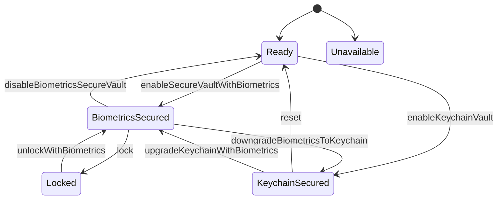

# Biometrics Vault

   

BiometricsVault is a Swift 6.0 package that makes supporting biometrics easy for an iOS/macOS application.

- [Description](#description)
- [Requirements](#requirements)
- [Installation](#installation)
- [How to use](#howtouse)
- [State diagram](#statediagram)
- [License](#license)

## Description

- BiometricsVault is a library that can store credentials to keychain in two specific ways: Unprotected or protected using biometrics (FaceID/TouchID).
- It is a state machine with a few states that are described below


## Requirements

iOS 14.0+ / macOS 12.0+

## Installation

### Swift Package Manager

The [Swift Package Manager](https://swift.org/package-manager/) is a tool for automating the distribution of Swift code and is integrated into the `swift` compiler.

Once you have your Swift package set up, adding BiometricsVault as a dependency is as easy as adding it to the `dependencies` value of your `Package.swift` or the Package list in Xcode.

```swift
dependencies: [
    .package(url: "https://github.com/ariskox/BiometricsVault.git", .upToNextMajor(from: "1.0.0"))
]
```

Normally you'll want to depend on the `BiometricsVault` target:

```swift
.product(name: "BiometricsVault", package: "BiometricsVault")
```

## How to use


## States

- Unavailable
    - The device or the application doesn't support authentication with biometrics.
- Ready
    - The Vault is ready to store the credentials to keychain with biometrics lock or unprotected
- ΒiometricsSecured
    - The credentials have been stored to the keychain and are protected by biometrics. They ARE available to us, as the user has been authenticated with biometrics. 🔓
- Locked
    - The credentials have been stored to the keychain and are protected by biometrics, but they are NOT available to us, UNLESS the user authenticates with biometrics first 🔒
- KeychainSecured
    - The credentials have been stored to the keychain but THEY ARE NOT protected by biometrics
  
## State diagram



## License

BiometricsVault is released under the MIT license. [See LICENSE](https://github.com/ariskox/BiometricsVault/blob/master/LICENSE) for details.
