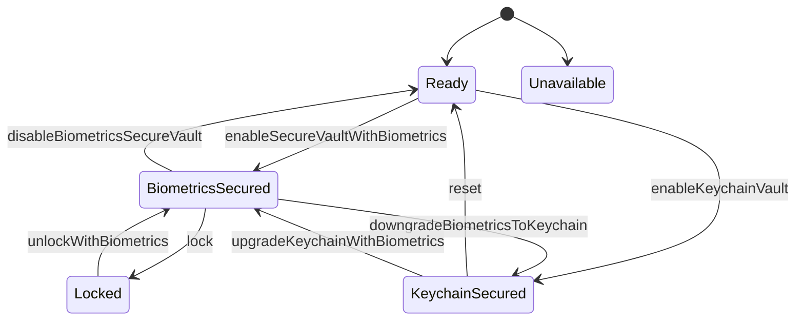

# Biometrics Vault

   

BiometricsVault is a Swift 6.0 package that makes supporting biometrics easy for an iOS/macOS application.

- [Description](#description)
- [Requirements](#requirements)
- [Installation](#installation)
- [Usage](#usage)
- [State diagram](#statediagram)
- [License](#license)

## Description

- BiometricsVault is a library that can store credentials to keychain in two specific ways: Unprotected or protected using biometrics (FaceID/TouchID).
- It is a state machine with a few states that are described below


## Requirements

- iOS 14.0+ / macOS 12.0+
- Xcode 16.0+

## Installation

### Swift Package Manager

The [Swift Package Manager](https://swift.org/package-manager/) is a tool for automating the distribution of Swift code and is integrated into the `swift` compiler.

Once you have your Swift package set up, adding BiometricsVault as a dependency is as easy as adding it to the `dependencies` value of your `Package.swift` or the Package list in Xcode.

```swift
dependencies: [
    .package(url: "https://github.com/ariskox/BiometricsVault.git", .upToNextMajor(from: "1.0.0"))
]
```

Normally you'll want to depend on the `BiometricsVault` target:

```swift
.product(name: "BiometricsVault", package: "BiometricsVault")
```

## Usage

### Without FaceID/TouchID

- Suppose that the user has just been logged in to our application and has aquired some credentials.

- Create an instance of the vault with a custom 'key' that will hold the credentials on the keychain. The key is just the name of the entry in the keychain. It shouldn't be anything special or an encryption key
- Save the credentials to the keychain without any special security 
```swift
let vault = BiometricsVault<Credentials>(key: "biometrics_credentials")
try vault.enableKeychainVault(saving: credentials)
```
- On app restart we can create an instance of the vault and check the state. If the state is 'keychainSecured' then we can retrieve the credentials
```swift
let vault = BiometricsVault<Credentials>(key: "biometrics_credentials")
switch vault.state {
case .keychainSecured(let credentials):
    // we can login the user, validate the token, or any other operation we'd like
default:
    break
}
```
- On logout just call reset
```swift
let vault = BiometricsVault<Credentials>(key: "biometrics_credentials")
vault.reset()
```

### Upgrade to FaceID/TouchID

- Once the user has been logged in, we can use the variable 'biometricsAvailable' to check if FaceID/TouchID can be enabled. If so, the add a button to your settings page.
- Once the enable button is pressed, use the 'upgradeKeychainWithBiometrics' function to store the credentials using biometrics authentication

```swift
let vault = BiometricsVault<Credentials>(key: "biometrics_credentials")
try await vault.upgradeKeychainWithBiometrics()
```
- The state now will be set to 'biometricsSecured' and you'll need to check for this when starting up your app
- You can use the 'lock' function to lock the vault. When the vault is locked you shouldn't keep the credentials in the memory anymore and the only screen you're allowed to display to the user is a 'Login with biometrics page' with a 'Login' button
- When the user taps this 'Login' button, you should call 'unlockWithBiometrics' and you'll get the credentials back after a successfull authentication

```swift
let vault = BiometricsVault<Credentials>(key: "biometrics_credentials")
let savedCredentials = try await vault.unlockWithBiometrics()
```

- When the user chooses to disable the FaceID/TouchID (and the vault isn't locked) you have two options. 
    - To downgrade to simple keychain security -> Call downgradeBiometricsToKeychain()
    - To forget the credentials -> Call disableBiometricsSecureVault

### Login with credentials and remember with FaceID/TouchID

- You want to use the function 'enableSecureVaultWithBiometrics' to transition from the 'ready' state to 'biometricsSecured'

### Example

For more information check the sample application at the directory [Example](https://github.com/ariskox/BiometricsVault/tree/main/Example)

## States

- Unavailable
    - The device or the application doesn't support authentication with biometrics.
- Ready
    - The Vault is ready to store the credentials to keychain with biometrics lock or unprotected
    - No credentials exist in the keychain, so the user is logged out
- ΒiometricsSecured
    - The credentials have been stored to the keychain and are protected by biometrics. They ARE available to us, as the user has been authenticated with biometrics. 🔓
    - The user is logged in and the credentials are available
- Locked
    - The credentials have been stored to the keychain and are protected by biometrics, but they are NOT available to us, UNLESS the user authenticates with biometrics first 🔒
    - The user is presented a 'Login with biometrics' screen. He/she can press 'Login' or 'Change account' (reset)
- KeychainSecured 
    - The credentials have been stored to the keychain but THEY ARE NOT protected by biometrics
    - The FaceID/TouchID have not been enabled. The user is logged in
  
## State diagram



## License

BiometricsVault is released under the MIT license. [See LICENSE](https://github.com/ariskox/BiometricsVault/blob/master/LICENSE) for details.
